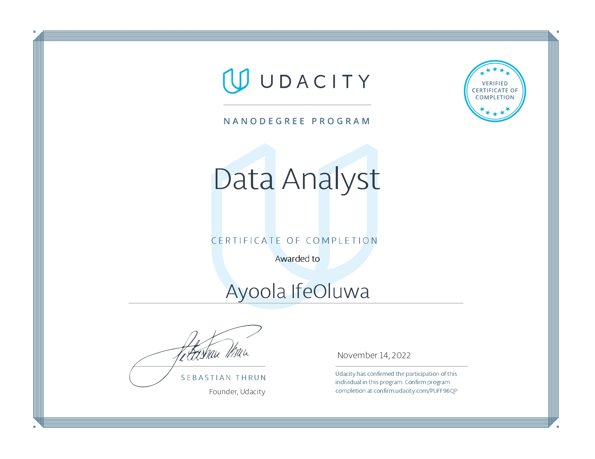

# Udacity Data Analyst Nanodegree
A collection of my projects for Udacity  [Data Analyst Nanodegree](https://www.udacity.com/course/data-analyst-nanodegree--nd002).

## Courses

* Introduction to Data Analysis with Python
* Introduction to Data Analysis with SQL
* Practical Statistics
* Exploratory Data Analysis with R

## Projects

* Project 1: Investigate a Dataset with Python – tMDB Dataset
* Project 2: Data Wrangling with Python - WeRateDogs Twitter account data
* Project 3: Prosper Loan Data Exploration

